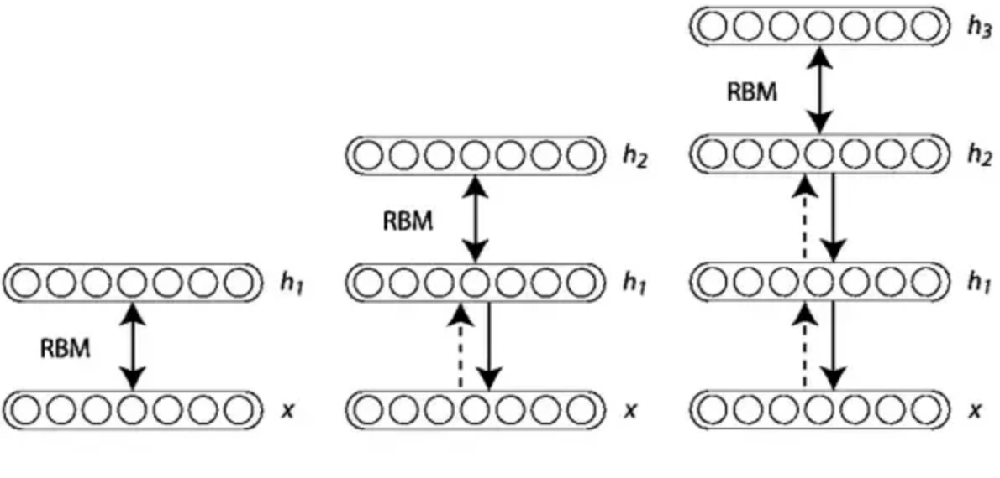

# Deep belief network and semi-supervised learning tasks
## Motivations
The goal of this project is to show that it is possible to improve the accuracy of a classifier using a Deep Belief Network, when one has a large number of unlabelled data and a very small number of labelled data. We use the MNIST dataset.
## Semi-supervised learning
As the name implies, semi-supervised learning lies between unsupervised learning, where we have no label at and try to discover interesting patterns in the data, and supervised learning where we have labels related to each data point. The principle of semi-supervised learning is to use unlabelled data in order to improve the performance of a supervised learning algorithm. This is of particular interest when one has a large number of unlabelled data points and only few labelled data points. In the real world, this occurs in many instances. One can thing about all the webpages, images, videos... available on the internet, for example. Labels may require human intervention and may be a costly and tedious task. More insights on semi-supervised learning can be found in the excellent book by Chapelle et al. "[Semi-supervised learning](http://www.acad.bg/ebook/ml/MITPress-%20SemiSupervised%20Learning.pdf)".
## Restricted Boltzmann Machines and Deep Belief Newtorks
[RBM](https://en.wikipedia.org/wiki/Restricted_Boltzmann_machine) are stochastic neural networks that can learn a probability distribution over its input, in an unsupervised way. RBM are generative models and can be used as feature extractor or to perform dimensionality reduction, among other things. RBM's can be trained using an efficient algorithm called contrastive divergence. 

DBN (deep belief net) are simply stacked RBM's. They can be trained in a greedy fashion, that is, each RBM is trained separately and the input of the second is the output of the first, and so forth.

## Methodology

We performed the following steps:

⋅⋅* We train a DBN on the MNIST dataset (we split 
