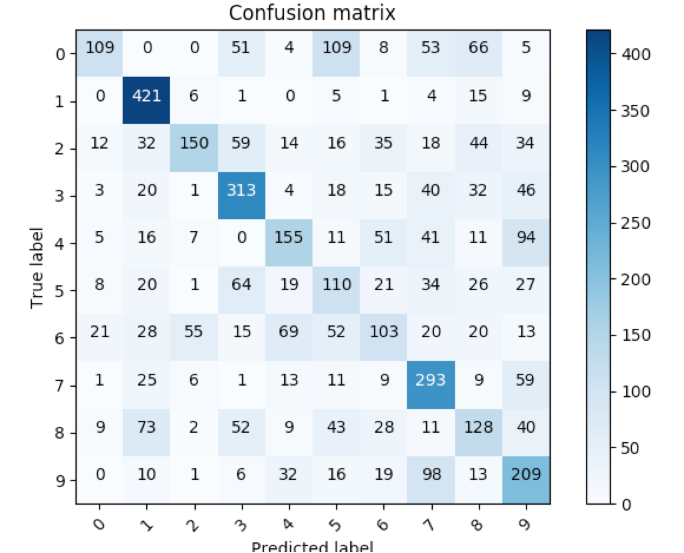

# Deep belief network and semi-supervised learning tasks
## Motivations
The goal of this project is to show that it is possible to improve the accuracy of a classifier using a Deep Belief Network, when one has a large number of unlabelled data and a very small number of labelled data. We use the MNIST dataset.
## Semi-supervised learning
As the name implies, semi-supervised learning lies between unsupervised learning, where we have no label at and try to discover interesting patterns in the data, and supervised learning where we have labels related to each data point. The principle of semi-supervised learning is to use unlabelled data in order to improve the performance of a supervised learning algorithm. This is of particular interest when one has a large number of unlabelled data points and only few labelled data points. In the real world, this occurs in many instances. One can thing about all the webpages, images, videos... available on the internet, for example. Labels may require human intervention and may be a costly and tedious task. More insights on semi-supervised learning can be found in the excellent book by Chapelle et al. "[Semi-supervised learning](http://www.acad.bg/ebook/ml/MITPress-%20SemiSupervised%20Learning.pdf)".
## Restricted Boltzmann Machines and Deep Belief Newtorks
[RBM](https://en.wikipedia.org/wiki/Restricted_Boltzmann_machine) are stochastic neural networks that can learn a probability distribution over its input, in an unsupervised way. RBM are generative models and can be used as feature extractor or to perform dimensionality reduction, among other things. RBM's can be trained using an efficient algorithm called contrastive divergence. 

DBN (deep belief net) are simply stacked RBM's. They can be trained in a greedy fashion, that is, each RBM is trained separately and the input of the second is the output of the first, and so forth.

## Methodology

The idea is to train a deep beelief network whose weights correspond to the weights of a multi-layer perceptron. We use the weights learnt by the DBN to initialize the MLP and train it on a very small data set. We use the architecture 500 - 500 - 2000, which is known to work well for this problem. This means that the DBN has an input layer of 784 dimensions (28*28, the size of the MNIST images) and three hidden layers of size 500 - 500 - 2000. The multi-layer perceptron has an 784-dimensional input layer and hidden layers of size 500 - 500 - 2000 as well. Its output layer is of size 10 (ten digits of the MNIST data set).

We performed the following steps:

1) We train a deep belief network on 90% of the MNIST dataset
2) We split the remaining 10% between 
  
    a) 2% for training the multi-layer perceptron (+- 90 data points)
    
    b) 98% for validation (+- 4400 data points)
    
    
## Results

We plot the confusion matrix for this low sample size high-dimensional classification problem. The nework is trained on +-9 datapoints for each classes

Here we have the results with the DBN weights, 57.094% accuracy

Here are the results with the gaussian-initialized weights, 48.372% accuracy

We repeated this experiment many times, with different splits for training/validation data. The DBN-initialized MLP consistently beat the MLP with gaussian random weights.
